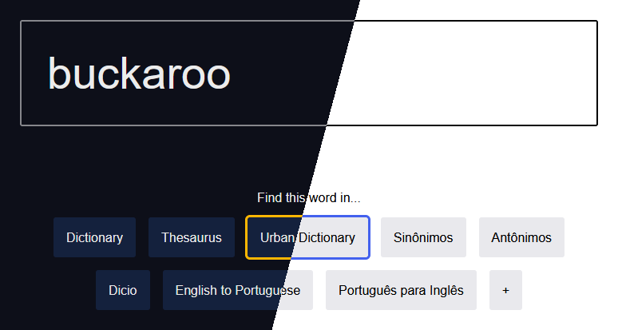

# Lexicon Tab

This is a page I've built to make it more convenient to search the definition of words in various dictionaries, translators and search engines online.

It works by having the option buttons, when selected, replace the dummy word in their link ("LEXICON") with what you typed in the search box, and then opening that link.

It is also possible to add new option buttons and delete them by right-clicking. Changes will be saved to local storage.
